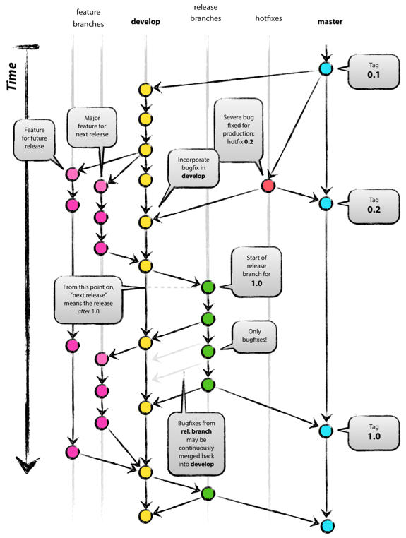

# Source Code Management - Branching and Merging Model

## Branching and Merging Model

  

  - Use Git Flow. See image above
  - Master branch contains stable code
  - 'develop' contains source code in development
